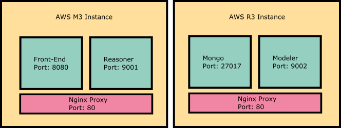

# DigitalEdge Visualization Wizard (VizWiz)


## Introduction

DigitalEdge's VizWiz is a search engine that matches data sets with visualizations.
For enterprises that have invested heavily in big data solutions, analysts are not only drowning in data, they are drowning in tools and analytics.
VizWiz accepts questions from the analyst in English (including domain specific terminology), and using a knowledge model for the given analytic domain, determines the purpose, or analytic intent, that corresponds to those questions.
Then, using a set of attribute tags, a visualization library, and schemas from Schema Wizard, it recommends the best tools, analytics, and data sets already available in the enterprise that matches that intent.
In short, VizWiz enables analysts to make best use of what’s available by finding what they need quickly and easily in a language that is relevant and natural to them.

## Getting Started

To begin using VizWiz, download or clone the https://github.com/deleidos/de-visualization-wizard.git project to your computer.

#### Requirements

In order to actively run the wizard, you will need the following:

1. Two (2) Linux Environments  (Ubuntu 14.04 - Trusty)
2. [Docker](https://docs.docker.com/engine/installation/) (>=1.12.0)
3. [Docker Compose](https://docs.docker.com/compose/install/) (>= 1.7.0)
4. [npm](https://docs.npmjs.com/getting-started/installing-node)
5. [bower](https://bower.io/#install-bower)
6. [grunt-cli](http://gruntjs.com/getting-started)
    
#### Architecture Diagram

The visualization wizard can be deployed in several different configurations, however, these instructions will follow a dual instance setup.



> *Note*: Even though the diagram utilizes AWS instances, any VM will suffice.
    
#### Modules/Functional Areas

The vizwiz application is broken into three distinct parts - the modeler, the reasoner, and the front-end.

The modeler section is used to seed the database with various data elements required by the application to complete the matching processes.
The modeler utilizes the command line to perform uploads, modifications, and deletes to the database. Each modeler tool is organized into a specific folder:

 * language-processing-service/modelerserver/
	+ domainmodeler/
	+ knowledgemodeler/
	+ schemamodeler/
	+ visualizationmodeler/
	
The domain modeler encompasses the tools that build a domain, its corpora, and model files.
The knowledge modeler encompasses the tools that build a taxonomy, its corpora, and model files.
The schema modeler encompasses the tools that build the data set meta data, schemas, and interpretation files.
The visualization modeler encompasses the tools that build a visualization object.

> *Note*: In order to run any tools on the command line, you must reference the python scripts in the lowest level folder.
	
 * reasoner/reasonerserver/
	+ datamatching/
	+ topicmatching/
	
The data matcher encompasses the logic that ranks data sets and visualizations.
The topic matcher encompasses the logic that matches questions to the knowledge model.
	
 * vizwiz-app/

The vizwiz app encompasses the HTML, CSS, and AngularJS services and business logic.

 * vizwiz-deployment/
	+ back-end/
	+ front-end/
	+ vagrant/
	
The back-end consists of the modeler and mongo docker-compose.yaml and the required pre-seeded data.
The front-end consists of the reasoner and app docker-compose.yaml.
Use the .env files to set domain names, image names, and tags.

[Vagrant](https://www.vagrantup.com/) is used for windows deployments only. Vagrant usage will require a separate installation.
	
#### Mongo

The vizwiz application requires a mongo database to collect and store the various domains, corpora, taxonomies, data sets, schemas, and visualizations.
Each of these elements are stored in a specific database and collection for optimal organization and search functionality.

The database layout is as follows:


 * DomainModelCorpora
	+ {Domain Names}
 * KnowledgeModelCorpora
	+ {Domain Names}
 * KnowledgeModelTaxonomy
	+ {Domain Names}
 * KnowledgeModelTfIdf
	+ {Domain Names}
 * {Domain Names}_mdl
	+ fs.chunks
	+ fs.files
 * vizwiz
	+ Dictonary
	+ Archetypes
	+ Encodings
	+ Interpretations
	+ PosMapping
	+ Spelling
	+ DataSets
	+ Domains
	+ Schemas

Users do not need to create any of the databases or collections. Using the various command line tools will automatically structure the database properly.
	
## Deployment

There are 3 steps to installing and deploying the Visualization Wizard from scratch:

1. Install dependencies
2. Configure app names and paths
3. Build the frontend with Grunt
4. Deploy with docker

Each step is described in more detail below.
	
#### Installing Dependencies

##### Docker
Docker is used for deployment of the VizWiz containers. See docker's website
for installation instructions: https://docs.docker.com/engine/installation/linux/

##### Docker Compose
Docker compose is a tool used to spin-up multiple containers at once.

    curl -L https://github.com/docker/compose/releases/download/1.8.0/docker-compose-`uname -s`-`uname -m` > /usr/local/bin/docker-compose
    chmod +x /usr/local/bin/docker-compose

##### Node.js
Node.js is used to run front end tools such as grunt. NPM, the node package manager to manage dependencies is also required.
To install node follow the instructions at: https://nodejs.org/en/download/package-manager/#debian-and-ubuntu-based-linux-distributions

##### Bower
Bower is dependency management tool used for frontend frameworks and libraries. Bower can be installed via npm.

```
npm install -g bower
```

##### Grunt
Grunt is a javascript task runner and build tool. Grunt can also be installed via npm.

```
npm install -g grunt-cli
```
	
##### Front-end dependencies
To install all front-end dependencies simply run the following:

```
cd de-visualization-wizard/vizwiz-app
npm install
```

The install script is configured to automatically run the bower install script as well so that everything gets installed together.

> *Note*: It is highly recommended that you **do not** run `npm install` as root as this may create permission errors. However, if you have already
run `npm install` as root, you should be able to fix issues by changing ownership of key directories back to the owner.

```
sudo chown -R $(whoami) /usr/local/bin
sudo chown -R $(whoami) /usr/local/share
sudo chown -R $(whoami) ~/.npm
sudo chown -R $(whoami) ~/.config
```

If issues persist, refer to npm's website.

#### Configure app names and paths

The following hostnames and image names must be configured manually before attempting a build:

de-visualization-wizard/vizwiz-deployment/front-end/docker-compose/.env
```
REASONER_IMAGE=
REASONER_TAG=
REASONER_HOSTNAME
MODELER_HOSTNAME=

VIZWIZ_IMAGE=
VIZWIZ_TAG=
VIZWIZ_HOSTNAME=
```

de-visualization-wizard/vizwiz-deployment/back-end/docker-compose/.env
```
MODELER_IMAGE=
TAG=
MODELER_HOSTNAME=
```

de-visualization-wizard/vizwiz-app/app/app.js
```
$rootScope.reasonerUrl = '';
$rootScope.modelerUrl = '';
```

de-visualization-wizard/language-processing-service/reasoner/developoment.ini
```
modelerlocation =
```

de-visualization-wizard/language-processing-service/reasoner/production.ini
```
modelerlocation =
```

> *Note*: modelerlocation must match MODELER_HOSTNAME above

#### Build the frontend with Grunt

As previously mentioned, the DigitalEdge Visualization Wizard uses grunt as its main task runner for front-end code. Pre-configured in the template are five tasks that complete common build procedures. These tasks are assembled from a collection of individual grunt tasks.

The included tasks are:

 * grunt serve - Starts an http server on local host, serves the application, and opens a web browser. A file watcher is included and will refresh the application in the browser whenever a file is changed.
 * grunt test - Runs unit tests in karma
 * grunt check-code - Runs two tools against the code to check for potential errors and code style:
    * jshint - Checks all js files for code quality and will report any warnings or errors it finds. The configuration for jshint can be found in the .jshintrc file. Learn more about jshint at http://jshint.com
    * jscs - Checks all js files for code style as defined in the .jscsrc file and automatically fixes any errors it finds. Learn more about jscs at http://jscs.info/
 * grunt build - Prepares code for production by concatenating and minifying all javascript app code. The result of this task is a dist/ folder that is placed at the root level of the project directory.
 * grunt docker_io - Builds and pushes the docker container. For more information, see the "Docker Containerization" section above.

In addition to these tasks, there is a default task which runs `grunt check-code`, `grunt test`, and `grunt build` in order. The default task can be run by simply running the `grunt` command.

> *Note*: Grunt must be run from the same directory that Gruntfile.js is located.
> *Note*: Any individual grunt task can be run using `grunt <taskname>`


#### Deploy with docker

There are three containers that need to be built and run for Visualization Wizard: the modeler, the reasoner, and the frontend vizwiz app.

The modeler should be built on the machine running the backend, which is the AWS R3 Instance if following the architecture described above.
Run the following to build the modeler image:

```
cd de-visualization-wizard/language-processing-service/modeler
sudo docker build -t <modeler-image-name>:<tag> .
```
	
The reasoner and the vizwiz app are to be build on the frontend machine, or the AWS M3 Instance in our architecture.
Reasoner:

```
cd de-visualization-wizard/language-processing-service/reasoner
sudo docker build -t <reasoner-image-name>:<tag> .
```
	
**Vizwiz App**:

> *Note*: Make sure the front-end app has been built with grunt before running `docker build`

```
cd de-visualization-wizard/vizwiz-app
sudo docker build -t <vizwiz-app-image-name:<tag> .
```

If the tag is omitted, docker will automatically append a tag of "latest".

The `sudo docker images` command can be run to check that the images were built successfully.

The next step is to run the containers from the images.

*Backend*:

```
cd de-visualization-wizard/vizwiz-deployment/back-end/docker-compose
docker-compose up -d
```

*Frontend*:

```
cd de-visualization-wizard/vizwiz-deployment/front-end/docker-compose
docker-compose up -d
```

Next, run `sudo docker ps -a` to see the running containers.

Here is an example output for the back-end:

```
CONTAINER ID        IMAGE                       COMMAND                  CREATED             STATUS              PORTS                         NAMES
e7e29ea715c6        modeler:latest              "pserve /usr/src/app/"   28 minutes ago      Up 28 minutes       9002/tcp                      dockercompose_modeler_1
62b5e952adb7        jwilder/nginx-proxy:0.2.0   "/app/docker-entrypoi"   28 minutes ago      Up 28 minutes       0.0.0.0:80->80/tcp, 443/tcp   dockercompose_nginx-proxy_1
b910569f2e39        mongo:3.2.1                 "/entrypoint.sh mongo"   28 minutes ago      Up 28 minutes       27017/tcp                     mongo
```

Here is an example output for the front-end:

```
CONTAINER ID        IMAGE                       COMMAND                  CREATED             STATUS              PORTS                         NAMES
78b917ea50c8        reasoner:latest             "pserve /usr/src/app/"   13 minutes ago      Up 12 minutes       9001/tcp                      dockercompose_reasoner_1
0076838b9327        jwilder/nginx-proxy:0.2.0   "/app/docker-entrypoi"   13 minutes ago      Up 12 minutes       0.0.0.0:80->80/tcp, 443/tcp   dockercompose_nginx-proxy_1
aa05e70d2fbd        vizwiz-ui:latest            "/docker-entrypoint.s"   13 minutes ago      Up 12 minutes       8080/tcp                      dockercompose_vizwiz_1
```
	
#### Vagrant
To run the Visualization Wizard on a Windows machine, you will need to use
[Vagrant](https://www.vagrantup.com/downloads.html) to set up virtual machines to run the docker containers.

```
cd de-visualization-wizard/vizwiz-deployment/vagrant
vagrant up
```

This will spin up two VMs, one called "backend" and one called "frontend". Next you will need to install the address plugin and
get the public IP addresses of each VM.

```
vagrant plugin install vagrant-address
vagrant address backend
vagrant address frontend
```

The Windows hosts file will need to be edited in order to run the application. In `C:\Windows\System32\drivers\etc\hosts`:

```
<backend-IP> <modeler-hostname>
<frontend-IP> <reasoner-hostname>
<frontend-IP> <vizwiz-hostname>
```

You can then run `vagrant ssh backend` and `vagrant ssh frontend` to ssh into the backend and frontend machines respectively to
continue local deployment.

On the front end run the following command to make sure the routing to the modeler container is done correctly:
```
export MODELER_HOST=<backend-IP>
```

<br/>
	
## Seeding the Database

In order to use the Visualization Wizard, the application must be seeded with data sets and visualizations available to users in the organization.
Without these, the application cannot perform its matching functions. Each required seed element has a standard data format and command line tool for upload.
You must cd to the appropriate tool suite under languauge-procssing-service on the host modeler container to use the command line.

List of Required Seed Elements:

 * Domain Names
 * Domain Corpora
 * Knowledge Model
 * Knowledge Model Corpora
 * Data Sets/Schemas
 * Visualizations
    
List of Optional Seed Elements:

 * Interpretations

<br/>

#### Key Terminology

 * _Domain_ - A domain is used to classify data and visualization applications into broad subject categories. Examples of typical domains include transportation, economics, national security. More detailed leveling can be introduced, but it must be consistent. For example, a company may align domains to departments.
 
 * _Domain Corpora_ - In order to process English questions for context, the visualization wizard needs a large sampling of domain specific text. A domain corpus refers to that body of text.
 
 * _Domain Model_ - A domain model is a processed domain corpus.
 
 * _Knowledge Model (Taxonomy)_ - A knowledge model taxonomy is used to classify a domain into sub-parts or specific problem categories. In an economics domain, first level children nodes may be organized by subdisciplines and methodologies. The end points, or leaf nodes, of the taxonomy should address a focused or pointed area or problem. 
 
 * _Knowledge Model Corpora_ - In order to link a question to a specific end point in the knowledge model taxonomy, the visualization wizard needs a sampling of text associated with the leaf nodes. A few detailed paragraphs is usually sufficient.
 
 * _tf-idf Model_ - A tf-idf Model is a processed knowledge model corpus.
 
 * _Schema_ - A schema is a meta-data model of a specific data set. Schemas used by the Visualization Wizard follow a specific format. DigitalEdge's other offering known as [Schema Wizard](https://github.com/deleidos/de-schema-wizard) can produce the schema format for a data set automatically. 
  
 * _Visualization_ - A visualization refers to a specific tool used to create images, diagrams, or animations using data.
 
 * _Interpretations_ - Interpretations are an English name, title, or explanation given to a data field to describe the values.
 
 * _Visual Encodings_ - Visual encodings are simple artistic properties that allow data to be represented. Example encodings are position, length, and area. These encodings are captured in a pre-configured dictionary and do not need to be modified. 

 * _wh Terms_ - The wh terms are any question word, including 'who', 'what', 'where', 'when', 'why', and 'how'. These terms are captured in a pre-configured dictionary and do not need to be modified. 

 * _Visualization Archetypes_ - Visualization archetypes are references to generic chart types and their corresponding visual encodings. The archetypes are pre-configured and only need to be referenced when adding a visualization to the database.
 
<br/>
 
#### Domain Modeler

Domains are used to categorize all of the data and visual tools into a specific environment.
Domains are a concept derived from the [Schema Wizard](https://github.com/deleidos/de-schema-wizard) tool.
Although the domain names can be anything, the best domains names are high-level categories that encompass a certain segment or concept.

Domain names can be introduced into the system using the following command:

```
python domainmodeler.py -n -D "<domain name>"
```

If you want to batch upload a list of domains, you can use the following command:

```
python domainmodeler.py -n -d "<path to domain name JSON file>"
```

The domain name JSON object should be formatting using the following structure:

| Field Name             | Values                                                                                                            | Format    | Optional?    |
|------------------------|-------------------------------------------------------------------------------------------------------------------|-----------|--------------|
| domains.domain         | Any                                                                                                               | String    | No           |

Example JSON Object:

```
{
    "domains":[
        { "domain" : "Transportation"},
        { "domain" : "Finance"}
    ]
}
```

In order for the application to learn about a domain's context, it requires a collection of written texts (corpus) on that particular domain.
The corpus can be created when adding a new domain to the system or after the domain has already been created.
If creating a domain and corpus at the same time, use the following command line scripts:

_Loading via a file (.PDF, .TXT)_
```
python domainmodeler.py -a -p "<path to domain corpus pdf>" -D "<domain name>"
python domainmodeler.py -a -f "<path to domain corpus text>" -D "<domain name>"
```

_Loading via web crawl (domainmodeler/config/{domain}.ini)_
```
python domainmodeler.py -a -t "<topics specified in ini file>" -D "<domain name>"
```

The .ini file should follow the following format and reside in the config folder:

```
[model name]
	model name : Transportation_mdl

[domain]
	domain : Transportation

[terms]
    terms :
	# General
	vehicle, car, travel

	# Vehicle Types
	sports cars, minivan, sedan, bike, motorcycle
```


At any time, you can list the domains loaded by running one of the following command:
```
python domainmodeler.py -l
python domainmodeler.py -l -D "<domain name>"
```

Once a domain and corpus are established, the system requires a model file.
This file is a compressed version of the corpus that allows the system to understand context and aids the speed of computation.

To build the corpus, use the following command:
 
```
python domainmodeler.py -w -D "<domain name>"
```

If for any reason, a domain and corpora needs to be removed form the database, simply use:

```
python domainmodeler.py -r -D "<domain name>"
```

<br/>

#### Knowledge Modeler

Knowledge models (a/k/a taxonomies) are used to divide a domain into focused subjects or groups.
These sub-classifications allow the application to better link specific data sets and visualizations.
The taxonomy should be designed as a tree, with more vague classifications becoming parent nodes.

Because taxonomies are mapped to specific domains, the command for creating a taxonomy requires the path to the JSON file and the domain name.

```
python knowledgemodeler.py -n -T "<path to taxonomy JSON file>" -D "<domain name>"
```

The taxonomy JSON format is described below:

| Field Name                          | Values                                                       | Format    | Optional?    |
|-------------------------------------|--------------------------------------------------------------|-----------|--------------|
| domain                              | Domain Name (must match)                                     | String    | No           |
| taxonomy.name                       | Any                                                          | String    | No           |  
| taxonomy.image                      | Fully Qualified Path to Image File                           | String    | Yes          |
| taxonomy.children[]                 | -                                                            | -         | Yes          |
| taxonomy.children[i].name           | Any                                                          | String    | Yes          |
| taxonomy.children[i].image          | Fully Qualified Path to Image File                           | String    | Yes          |
| taxonomy.children[i].subquestion    | Any                                                          | String    | Yes          |
| taxonomy.children[i].subanswers[]   | Any                                                          | String    | Yes          |
| taxonomy.children[i].disabled       | true, false                                                  | Boolean   | Yes          |
| taxonomy.children[i].children[]     | -                                                            | -         | Yes          |

> *Note*: Subquestions and subanswers should only appear on leaf (end) nodes/children and are used to refine an end node.
Refinements could include a follow-on question about a methodology, or something as basic as choosing a type that does not have enough corpus literature to build into its own leaf node.

Example JSON Object:

```
{
	"domain": "Transportation",
	"taxonomy": [{
		"name": "Vehicles",
		"image": "/assets/img/wheel-icon.png",
		"children": [{
			"name": "Cars",
			"image": "/assets/img/car-icon.png",
			"children": [{
				"name": "Sports Cars",
				"image": "/assets/img/money-icon.png",
				"children": [{
					"name": "Ferrari",
					"image": "/assets/img/italian-flag-icon.png",
					"subquestion": "Choose a specific type:",
					"subanswers": ["458", "LaFerrari", "FF"]
				}, {
					"name": "Audi",
					"image": "/assets/img/german-flag-icon.png"
				}, {
					"name": "Lamborghini",
					"image": "/assets/img/italian-flag-icon.png"
				}]
			}, {
				"name": "Family Cars",
				"image": "/assets/img/family-icon.png",
				"children": [{
					"name": "TBD",
					"disabled": true
				}]
			}]
		}]
	}]
}
```

Much like the domain models, the application learns context by using a collection of written texts (corpus) for each endpoint of the taxonomy.
The more precise the text in relation to the endpoint, the better the results.

```
python knowledgemodeler.py -a -D "<domain name>" -c "<path to corpus JSON file>"
```

Corpora files should be formatted in the following way:

| Field Name                          | Values                                                       | Format    | Optional?    |
|-------------------------------------|--------------------------------------------------------------|-----------|--------------|
| corpora.domain                      | Domain Name (must match)                                     | String    | No           |
| corpora.topic                       | End Point Name (must match)                                  | String    | No           |  
| corpora.body                        | Any Text About Topic				                         | String    | No           |

```
{
	"corpora": [{
		"domain": "Transportation",
		"topic": "Ferrari",
		"body": "Ferrari S.p.A. is an Italian sports car manufacturer based in Maranello. Founded by Enzo Ferrari in 1939 as Auto Avio Costruzioni, the company built its first car in 1940. However, the company's inception as an auto manufacturer is usually recognized in 1947 when the first Ferrari-badged car was completed. Throughout its history, the company has been noted for its continued participation in racing, especially in Formula One, where it is the most successful racing team, holding the most constructors championships (16) and having produced the highest number of winning drivers (15). Ferrari road cars are generally seen as a symbol of speed, luxury and wealth. Since the company's beginnings, Ferrari has been involved in motorsport, competing in a range of categories including Formula One and sports car racing through its Scuderia Ferrari sporting division as well as supplying cars and engines to other teams and for one make race series. The company's loftiest efforts have been in the supercar market. The 1962 250 GTO may be considered the first in the line of Ferrari supercars, which extends to the recent LaFerrari model. The famous symbol of the Ferrari race team is the Cavallino Rampante (\"prancing horse\") black prancing stallion on a yellow shield, usually with the letters S F (for Scuderia Ferrari), with three stripes of green, white and red (the Italian national colors) at the top. The road cars have a rectangular badge on the hood (see picture at top of page), and, optionally, the shield-shaped race logo on the sides of both front wings, close to the door."
	}]
}
```

> *Note*: All quotes and special characters need to be escaped uing a slash.

Any updates or to a taxonomy can be made using a special update function that reloads the JSON file.

```
python knowledgemodeler.py -n -T "<path to taxonomy JSON file>"
```

To view the stored taxonomies use:

```
python knowledgemodeler.py –l -D "<domain name>"
```

Once a taxonomy and corpus are established, the system requires a model file. This file stores the output of a [tf-idf](http://tfidf.com/) calculation.
The model can be built using:

```
python knowledgemodeler.py --tfidf -D "<domain name>"
```

And viewed using:
```
python knowledgemodeler.py -L -D "<domain name>" -c "<leaf node name>"
```

Taxonomies and tf-idf results can be deleted using the following command:

```
python knowledgemodeler.py -r -D "<domain name>"
```

<br/>

#### Data Sets

Adding data sets to the database requires two steps. A top-level description is initially required to capture usage information about a particular data set.
Then, the actual schema describing individual data fields should be uploaded.
Currently, the system assumes that a data set is the end result of a specific analytic and can be accessed via API or directly.

The top-level must follow the following structure:

| Field Name            | Values                                                                                                            | Format    | Optional?    |
|-----------------------|-------------------------------------------------------------------------------------------------------------------|-----------|--------------|
| name                  | Any                                                                                                               | String    | No           |
| schema_ID             | UUID (Hex)                                                                                                        | String    | No           |  
| analytic_URI          | HTTP Link or File Path                                                                                            | String    | No           |
| connection_type       | "REST", "WEBSOCKET"                                                                                               | String    | Yes          |
| delivery_mechanism    | "STREAMING", "PUB/SUB", "REQ/RESP"                                                                                | String    | Yes          |
| analytic_type         | "DESCRIPTIVE", "PREDICTIVE", "EXPLORATORY", "INFERENTIAL", "DIAGNOSTIC", "CAUSAL", " MECHANISTIC", "PRESCRIPTIVE" | String    | No           |
| data_state            | "HISTORIC", "REAL-TIME"                                                                                           | String    | Yes          |
| domain                | Domain Name (must match)                                                                                          | String    | No           |
| intents[]             | "RELATIONSHIP", "DISTRIBUTION", "COMPOSITION", "COMPARISON"                                                       | String    | Yes          |


Example JSON Object:

```
{
    "name": "Vehicle Data",
    "schema_ID": "abcdef12-3456-7890-abcd-ef1234567890",
    "analytic_URI": "C:/Data/Vehicle-Data.json",
    "connection_type": "WEBSOCKET",
    "delivery_mechanism": "REQ/RESP",
    "analytic_type": "DESCRIPTIVE",
    "data_state": "HISTORIC",
    "domain": "Transportation",
    "intents": ["DISTRIBUTION"]
}
```

 * _Analytic Type_: 
 
    + _Descriptive_     - what has happened 
    + _Exploratory_     - what has happened that I didn't see
    + _Inferential_     - test my theory
    + _Diagnostic_      - why did it happen
    + _Predictive_      - what could happen
    + _Causal_          - what would happen (if I change x)
    + _Mechanistic_     - how is everything related
    + _Prescriptive_    - what should I do
    
 * _Intents_:
 
    + _Relationship_    - the way in which two or more concepts, objects, or people are connected, or the state of being connected.
    + _Distribution_    - the way in which something is shared out among a group or spread over an area.
    + _Composition_     - the nature of something's ingredients or constituents; the way in which a whole or mixture is made up.
    + _Comparison_      - estimate, measure, or note the similarity or dissimilarity between.

To add the top-level data set object to the database use the following command:
```
python schemamodeler.py -a -S "<path to data-set JSON file>"
```

The schema must follow the following structure:

| Field Name                         | Values                                                  | Format             | Optional?    |
|------------------------------------|---------------------------------------------------------|--------------------|--------------|
| sId                                | UUID (must match)                                       | String             | No           |
| sName                              | Any                                                     | String             | No           |  
| sProfile.fullName                  | Any (dot separated layers)                              | String             | No           |
| sProfile.displayName               | Any (dot spearated layers)                              | String             | No           |
| sProfile.interpretation            | Interpretation Name (must match) or "Unknown"           | String             | No           |
| sProfile.attributes.identifier     | "true", "false"                                         | String             | No           |
| sProfile.attributes.categorical    | "true", "false"                                         | String             | No           |
| sProfile.attributes.quantitative   | "true", "false"                                         | String             | No           |
| sProfile.attributes.relational     | "true", "false"                                         | String             | No           |
| sProfile.attributes.ordinal        | "true", "false"                                         | String             | No           |
| sProfile.mainType                  | "string", "number", "boolean"                           | String             | No           |
| sProfile.detailType                | "term", "phrase", "integer", "decimal", ""              | String             | No           |
| sProfile.presence                  | Any                                                     | Number, Percentage | Yes          |
| sProfile.numberDistinctValues      | Any                                                     | Number, Integer    | No           |


Example JSON Object:

```
{
    "sId": "abcdef12-3456-7890-abcd-ef1234567890",
    "sName": "Vehicle Data",
    "sProfile": [{
        "fullName": "vehicles.car.manufacturer",
        "displayName": "car.manufacturer",
        "interpretation": "Unknown",
        "attributes": {
            "identifier": false,
            "categorical": true,
            "quantitative": false,
            "relational": false,
            "ordinal": false
        },
        "mainType": "string",
        "detailType": "term",
        "presence": 0.5,
        "numberDistinctValues": 15
    }]
}
```

It is imperative that the sID for the top-level data set descriptor and the schema match. Otherwise, the results will not be accurate. 

For the five fields that compose the attributes section, only one may true at a time.
For instance, if a data field is considered ordinal, it cannot be an identifier, categorical, relational, or quantitative.
All fields set to false is acceptable, however, the visualization matching results will suffer.

Attribute Definitions and Examples:

* _Identifier_ - Identifiers are fields that distinguish an individual line of data or field from another. 
    + UUID
    + Names
    + Airport Codes
* _Categorical_ - Categorical data groups things that are alike but not ranked, ordered, or numbered.
    + Flavors
    + Regions
    + Teams
    + Departments
* _Quantitative_ - Quantitative data is information about quantities; that is, information that can be measured and written down with numbers.
    + Height
    + Shoe Size
    + Altitude
    + Speed
* _Relational_ - Relational data indicates grouping, hierarchy, influence, correlation or other non-numeric interactions.
    + Military ranks
    + Family Relations
* _Ordinal_ - Ordinal data is a statistical data type consisting of numerical scores that exist on an ordinal scale, i.e. an arbitrary numerical scale where the exact numerical quantity of a particular value has no significance beyond its ability to establish a ranking over a set of data points.
    + Grade Level
    + Finishing Place
    
Presence represents the occurrence of a specific field used when multiple raw data sets are merged.
In the example vehicle JSON, the data set is made up of aircraft and boat records. 
Any field specific to boats, such as deadweight tonnage, would create a presence of 0.5 since it exists in only half of the data sets. 
The presence must always be a number >0 and <=1. 

Number of distinct values may be determined from a sample of data rather than the whole data collection.
A good sample consists of 2000 records, but the amount could be smaller depending on the data.

To add a schema to the database, use the following command:
```
python schemamodeler.py -a -s "<path to schema JSON file>"
```

Listing data sets requires one of the following commands:
```
python schemamodeler.py –l
python schemamodeler.py -l -s "<sname>"
python schemamodeler.py -l -s "<sId>"
```

To delete a schema and data set concurrently use the sId in the following:
```
python schemamodeler.py -r "<sId>"
```

##### Interpretations

Interpretations are another concept derived from the [Schema Wizard](https://github.com/deleidos/de-schema-wizard) tool.
Interpretations help give data meaning. Vizwiz uses interpretations when asking about a seed value, or starting data field that a user may want to key off of.

To add a single interpretation, the following command can be used:
```
python schemamodeler .py -a -I "<interpretation>"
```

Batch uploading is also possible using:
```
python schemamodeler .py -a -i "<path to interpretations JSON file>"
``` 

Batch uploads require the following format:

| Field Name                    | Values                      | Format    | Optional?    |
|-------------------------------|-----------------------------|-----------|--------------|
| interpretation                | Any                         | String    | No           |

Example JSON Object:

```
{
	"interpretations": [{
		"interpretation": "MPH"
	}, {
		"interpretation": "Latitude"
	}, {
		"interpretation": "Longitude"
	}]
}
```

You can list all interpretations by using the following command:
```
python schemamodeler.py -l -i "<interpretation>"
```

And deletions are completed through:
```
python schemamodeler.py -r -i "<interpretation>"
```

<br/>

#### Visualizations/Applications

Visualizations are the final required element for vizwiz. Many of the fields required by the visualization object have already been discussed and are present in other elements. 


| Field Name                    | Values                                                                                                            | Format    | Optional?    |
|-------------------------------|-------------------------------------------------------------------------------------------------------------------|-----------|--------------|
| name                          | Any                                                                                                               | String    | No           |
| analytic_type                 | "DESCRIPTIVE", "PREDICTIVE", "EXPLORATORY", "INFERENTIAL", "DIAGNOSTIC", "CAUSAL", " MECHANISTIC", "PRESCRIPTIVE" | String    | No           |  
| archetypes[]                  | Archetype Name (must match)                                                                                       | String    | No           |
| domains[]                     | Domain Name (must match)                                                                                          | String    | No           |
| mandatory_interpretations[]   | Interpretation Name (must match) or "Unknown"                                                                     | String    | Yes          |
| thumbnail                     | HTTP Link or Path to a Representative Image                                                                       | String    | No           |
| link                          | HTTP Link, Path, or Instructions to the Visualization                                                             | String    | No           |

Example JSON Object:

```
{
    "name": "Vehicle Location Map",
    "analytic_type": "DESCRIPTIVE",
    "archetypes": [
        "Dot Distribution Map"
    ],
    "domains": [
        "Transportation"
    ],
    "mandatory_interpretations": [
        "latitude",
        "longitude"
    ],
    "thumbnail": "http://",
    "link": "http://"
}
```

Analytic type for visualizations uses the same definitions that are applicable in the top-level of a data set.

All visualizations should contain at least one archetype that helps to define the loaded element even if it isn't a perfect match.
The DigitalEdge team has pre-configured 42 different visuals that encompass most of the common types.
For example, a mapping application that tracks movement of various cars would be similar to a 'Dot Distribution Map'.

To add a visualization element, use the following command:
```
python visualizationmodeler.py -a -V "<path to visualization JSON file>"
```

Updates use the same add command and will simply overwrite the element.

A list of all visual elements can be seen using:
```
python visualizationmodeler.py -l
python visualizationmodeler.py -l -v "<visualization name>"
```

And finally, to delete a visualization use the following command:
```
python visualizationmodeler.py -r -v "<visualization name>"
```


**_List of Useable Archetype Names_**: 

[Alluvial Diagram](http://nickrabinowitz.com/projects/d3/alluvial/alluvial-dynamic.html), [Arc Diagram](http://bl.ocks.org/sjengle/raw/5431779/),
[Area Chart](http://bl.ocks.org/supereggbert/raw/aff58196188816576af0/), [Bar Chart](http://bl.ocks.org/mbostock/raw/3885304/),
[Biplot](http://www.datavis.ca/papers/viscollin/figs/cars-biplot32.jpg), [Box Plot](http://bl.ocks.org/mbostock/raw/4061502/),
[Bubble Chart](http://bl.ocks.org/mbostock/raw/4063269/), [Carpet Plot](https://upload.wikimedia.org/wikipedia/commons/c/c8/Cheater_plot_filled_contour.svg),
[Cartogram](http://bl.ocks.org/mbostock/raw/4055908/), [C-chart](https://controls.engin.umich.edu/wiki/images/6/6b/Example_3_figures_1.JPG),
[Chord Diagram](http://bl.ocks.org/mbostock/raw/4062006/), [Choropleth Map](http://bl.ocks.org/mbostock/raw/4060606/), [Contour Map](http://bl.ocks.org/mbostock/raw/4241134/),
[Dendogram](http://bl.ocks.org/mbostock/raw/4063570/), [Dependency Graph](http://www.redotheweb.com/DependencyWheel/),
[Dot Distribution Map](http://bl.ocks.org/mtaptich/15be31d06f1c45991aaf), [Florence Nightengale Fan](http://one-barton-family.us/genealogy/images/fan_hmb.jpg),
[Heat Map](http://bl.ocks.org/tjdecke/raw/5558084/), [Histogram](http://bl.ocks.org/mbostock/raw/3048450/), Hyperbolic Tree, 
[Line Chart](http://bl.ocks.org/mbostock/raw/3883245/), [Log-Log Plot](http://bl.ocks.org/mbostock/raw/1341679/), 
[Marimekko Chart](http://bl.ocks.org/mbostock/raw/1005090/), [Matrix](http://bost.ocks.org/mike/miserables/),
[Mosaic Plot](https://upload.wikimedia.org/wikipedia/commons/8/84/Mosaic-big.png), [Node-Link Diagram](http://bl.ocks.org/sathomas/11550728),
[Parallel Set](https://www.jasondavies.com/parallel-sets/), [Pie Chart](http://bl.ocks.org/mbostock/raw/3887235/), [Polar Area Diagram](http://bl.ocks.org/mbostock/raw/4583749/),
[Proportional Symbol Map](https://rkpjrhist615.files.wordpress.com/2007/10/lab7.jpg), [Radar Chart](http://bl.ocks.org/nbremer/raw/6506614/), 
[Radial Tree](http://bl.ocks.org/mbostock/raw/4063550/), [Sankey Diagram](http://bl.ocks.org/d3noob/raw/c9b90689c1438f57d649/), 
[Scatter Plot](http://bl.ocks.org/weiglemc/raw/6185069/), [Spaghetti Plot](http://blog.enthought.com/wp-content/uploads/bootstrap_spag.png), 
[Stream Graph](http://bl.ocks.org/WillTurman/raw/4631136/), [Temporal Fan Chart](https://upload.wikimedia.org/wikipedia/commons/8/83/FanChartInfl.jpg),
[Temporal Raster Plot](https://en.wikipedia.org/wiki/Temporal_Raster_Plot#/media/File:Ambient-temperature-ausgburg.png), 
[Timeline](http://bl.ocks.org/bunkat/raw/2338034/), [Tree Map](http://bl.ocks.org/mbostock/raw/4063582/), 
[Venn Diagram](http://benfred.github.io/venn.js/examples/intersection_tooltip.html), [Waterfall Chart](http://bl.ocks.org/rsloan/raw/7123450/), 
[Word Cloud](http://bl.ocks.org/ericcoopey/6382449)

> *Note*: The archetype name listed in the visualization element must match exactly to one of the archetypes listed above.

The visualization can also require certain interpretations to be present. For instance, a map may require latitude and longitude fields in order to function properly.
Although interpretations are considered optional, adding them will strengthen the matching results.
The key name is written as "mandatory interpretations" because it implies the interpretation is mandatory to the visualization.

<br/>

#### Summary of Command Line Scripts

|Action                   |Command                                                                                      |
|-------------------------|---------------------------------------------------------------------------------------------|
| __Domains__			  |																								|
|*Add Domain*             | ```python domainmodeler.py -n -D "<domain name>"``` 										|
|*Add Domains*            | ```python domainmodeler.py -n -d "<path to domain name JSON file>"```  						|
|*Add Domain w/ Docs*     | ```python domainmodeler.py -a -f "<path to domain corpus text file>" -D "<domain name>"```	|
|*Add Domain w/ PDF*      | ```python domainmodeler.py -a -p "<path to domain corpus pdf file>" -D "<domain name>"```	|
|*Add Domain w/ Websites* | ```python domainmodeler.py -a -t "<path to .ini file>" -D "<domain name>"```  				|
|*Update Domain Titles*   | ```python domainmodeler.py -R -D "<old domain>:<new domain>"```								|
|*List Domains*           | ```python domainmodeler.py -l -D "<domain name>"```											|
|*Delete Domain*          | ```python domainmodeler.py -r -D "<domain name>"```											|
|*Build Model*            | ```python domainmodeler.py -w -D "<domain name>"```											|
|*Build Status*           | __TBD__																						|
| __Taxonomies__	      |																								|
|*Create a Taxonomy*      | ```python knowledgemodeler.py -n -T "<path to taxonomy JSON file>" -D "<domain name>"``` 	|
|*Add Corpus to Taxonomy* | ```python knowledgemodeler.py -a -D "<domain name>" -c "<path to corpus JSON file>"```		|
|*Update Taxonomy*        | ```python knowledgemodeler.py -n -T "<path to taxonomy JSON file>"```  						|
|*List Taxonomies*        | ```python knowledgemodeler.py –l -D "<domain name>"``` 							     		|
|*Delete Taxonomy*        | ```python knowledgemodeler.py -r -D "<domain name>"``` 						   				|
|*Run tf-idf*             | ```python knowledgemodeler.py --tfidf -D "<domain name>"```  								|
|*List tf-idf*            | ```python knowledgemodeler.py -L -D "<domain name>" -c "<leaf node name>"```				|
| __Data Sets__           |																								|
|*Add Data Set*           | ```python schemamodeler.py -a -S "<path to data-set JSON file>"```							|
|*Add Schema*             | ```python schemamodeler.py -a -s "<path to schema JSON file>"```  							|
|*List Data Set*          | ```python schemamodeler.py -l -S "<name>"``` OR ```python schemamodeler.py -l -S "<sId>"``` |
|*List All Data Sets*     | ```python schemamodeler.py –l```  															|
|*List Schema*            | ```python schemamodeler.py -l -s "<sname>"``` OR ```python schemamodeler.py -l -s "<sId>"```|
|*List All Schemas*       | ```python schemamodeler.py –l```  															|
|*Delete*                 | ```python schemamodeler.py -r "<sId>"```  													|
|*Add Interpretation*     | ```python schemamodeler .py -a -I "<interpretation>"```										|
|*Add Interpretations*    | ```python schemamodeler .py -a -i "<path to interpretations JSON file>"```					|
|*List Interpretations*   | ```python schemamodeler.py -l -i "<interpretation>"```										|
|*Delete Interpretation*  |	```python schemamodeler.py -r -i "<interpretation>"```										|
| __Visualizations__      |																								|
|*Add Visualization*      | ```python visualizationmodeler.py -a -V "<path to visualization JSON file>"```  			|
|*Update Visualization*   | ```python visualizationmodeler.py -a -V "<path to visualization JSON file>"```  			|
|*List Visualization*     | ```python visualizationmodeler.py -l -v "<visualization name>"``` 							|
|*List Visualizations*    | ```python visualizationmodeler.py -l```  													|
|*Delete Visualization*   | ```python visualizationmodeler.py -r -v "<visualization name>"```  							|

> *Note*: In order to run any tools on the command line, you must reference the python script location correctly.
> *Note*: Adding a -h flag to any python script will load a help menu. For more detailed error messaging, turn on verbose mode.

## Using the Application

To use the application, open the landing page in a browser. The url should be the IP address or domain name of the front-end instance.
If the application has been properly seeded using the steps listed above, then using the tool should be fairly simple.

Start by choosing a domain. This should load the appropriate knowledge model. Ask a question and let the reasoner load the best topic matches.
Choose a topic and continue to the sub question section if applicable.

When you arrive at the data options, choose a starting value (if one is known), and a interpretation.

## Other Deployment Notes

Although the deployment instructions covered a dual instance set-up, enterprise level organizations would be best served using a three instance approach. 
The first instance should be comparable to an AWS m3 instance. This instance is general purpose and can serve the front-end and reasoning engine.
The second instance should be comparable to an AWS r3 instance. This instance focuses on memory and is ideal for the mongo database.
Depending on the size of the organization, more volumes may need to be attached to store the corpus files.
The third VM should be structured similar to AWS's c3. This instance would contain the modeler which runs compute heavy algorithms that can take several hours to complete.
An additional docker compose file will be necessary to add a third instance.

It is also possible to run all of the containers on a single instance for more compact deployment.
A single instance will require all of the docker compose files to be combined.

## Versioning

Vizwiz is listed as part of the DigitalEdge 3.0.0-beta release. This is the initial release for this application.

Current version: 3.0.0-beta2

## Testing

## Troubleshooting

## FAQ

## Maintainers

The DigitalEdge Visualization Wizard is managed by the DigitalEdge team. DigitalEdge is a product of Leidos, Inc.

11951 Freedom Drive
Reston, VA 20190

## License

The DigitalEdge Visualization Wizard is licensed for use under the [Apache 2.0](http://www.apache.org/licenses/LICENSE-2.0) license.

The Visualization Encodings are licensed for use under the [Creative Commons BY SA](https://creativecommons.org/licenses/by-sa/3.0/us/) license.
Groupings were added to the Visualization Encodings based on the work of Noah Iliinsky of ComplexDiagrams.com 
